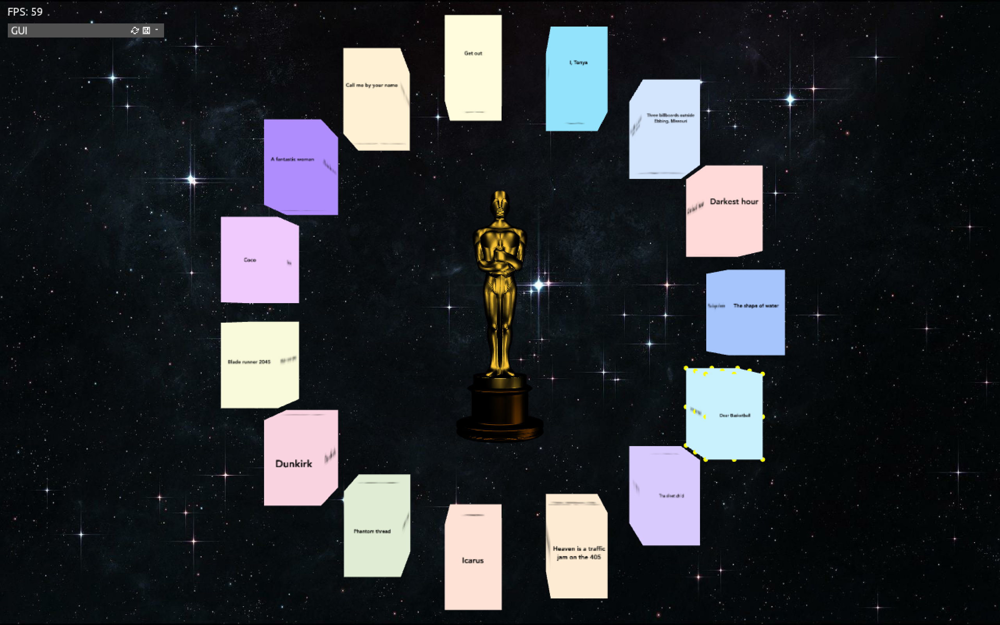

# Oscar universe

This system represents a universe where each planet-box corresponds to a movie that won at least one Oscar in 2017. 

By clicking on each planet-box, users can delve deeper into each movie. Upon selection, the camera moves inside the chosen planet-box, revealing the inner facets, while the soundtrack of the selected movie plays softly in the background. The information displayed on the four faces of the box is the following:  
* The movie poster
* Film details: title, director, genre, plot
* Oscar details: nominations and awards
* Film trailer
  
At the top left of the screen, a GUI explains to users how to interact with the system and enables them to adjust the rotation speed of the box-planet faces and the volume of the trailer and soundtrack.

Please note: all official posters, trailers, and soundtracks have been replaced with royalty-free media files in the repository to adhere to copyright regulations.

## How to try the system

The system uses the open source C++ toolkit openFrameworks. To try it out, download the openFrameworks library from
[http://www.openframeworks.cc/download/](http://www.openframeworks.cc/download/).

Create a new project using the Project Generator wizard.
Replace the `scr` and `data` folders of the empty project with the `scr` and `data` folders of the repository.

The system needs the following addons:
* ofxAssimpModelLoader
* ofxGui
* ofxJSON
* ofxRaycaster
